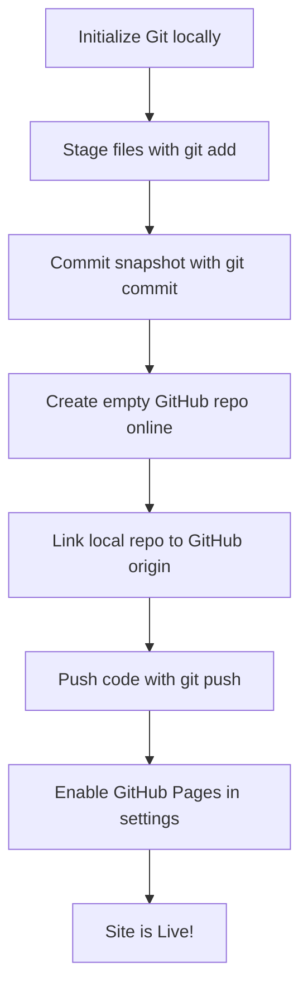

# Git, GitHub, and Portfolio Web Development Guide

A reference document outlining fundamental web technologies, version control concepts, Git workflows, and deployment via GitHub Pages.

---

## 🌐 Web Development Fundamentals

A standard static portfolio website consists of three core technologies:

1.  **HTML (HyperText Markup Language):** The structural backbone of the site. It defines the content blocks (e.g., headings, paragraphs, sections, buttons).
2.  **CSS (Cascading Style Sheets):** Controls the styling, layout, typography, and visual presentation (e.g., grid alignments, colors, hover effects, shadows).
3.  **JavaScript (JS):** Adds interactivity, logic, and dynamic behaviors (e.g., scroll reveals, interactive forms, copy-to-clipboard actions).

---

## 🛠️ Git & GitHub Workflow

### What is Git vs. GitHub?
*   **Git:** A local *command-line tool* that tracks changes in your source code over time. It runs entirely on your local computer and does not require internet access.
*   **GitHub:** A *web-based platform* that hosts Git repositories in the cloud. It allows you to back up your code, collaborate with others, and deploy your site.

### Step-by-Step Deployment Workflow

Below is the standard sequence to get your local portfolio website pushed to GitHub and deployed live:



#### 1. Initialize Git in your project folder
Open a terminal in your project's root folder (`C:\Users\paran\Desktop\CLIproject\portfolio-web`) and run:
```bash
git init
```
*This creates a hidden `.git` folder that tracks code history.*

#### 2. Stage your files
Tell Git which files you want to include in your next snapshot:
```bash
git add .
```
*The `.` stages all modified and new files in the folder.*

#### 3. Commit your changes
Save the snapshot of your files with a descriptive message:
```bash
git commit -m "Initial commit of portfolio codebase"
```

#### 5. Push code to GitHub
Send your local commits to your remote repository on GitHub:
```bash
git push -u origin main
```
*The `-u origin main` tells Git to remember this remote branch for future pushes (so you only need to type `git push` next time).*

#### 6. Deploy via GitHub Pages
To make your website publicly accessible:
1. Go to your repository on GitHub.com.
2. Navigate to **Settings** > **Pages** (under the "Code and automation" section).
3. Under **Build and deployment** > **Branch**:
   * Select `main` as the source branch.
   * Since your website code is located in the `docs` folder, select `/docs` from the folder dropdown (instead of `/ (root)`).
4. Click **Save**.
5. Within a couple of minutes, your site will be live at `https://<your-username>.github.io/<repo-name>/`.

---

## 📖 Key Technical Terms Glossary

### Web Development Terms
*   **Static Website:** A website made of fixed files (HTML, CSS, JS) that delivers the exact same content to every visitor. It does not require a database or server-side processing (unlike a dynamic database-driven site like WordPress or Facebook).
*   **Semantic HTML:** Using HTML tags that describe their meaning (e.g., `<header>`, `<main>`, `<article>`) rather than generic containers (`<div>`). This helps search engines (SEO) and screen readers read the page.
*   **Responsive Design:** Designing a website so that it automatically scales, wraps, and rearranges itself to look great on any screen size (mobile, tablet, desktop).
*   **Media Queries:** CSS rules used to apply styles conditionally based on device properties (e.g., `@media (max-width: 768px)` applies styles only on screens narrower than 768px).
*   **DOM (Document Object Model):** The browser's internal representation of the HTML document structure. JavaScript uses the DOM to manipulate text, styles, and elements dynamically.

### Git & Version Control Terms
*   **Repository (Repo):** A project folder tracked by Git.
*   **Commit:** A saved snapshot of changes. Every commit has a unique ID and a message describing what changed.
*   **Staging Area (Index):** A draft preparation area where you select which file changes will be included in the next commit.
*   **Remote (e.g., "origin"):** A version of your repository hosted on a server (like GitHub). "Origin" is the default name Git gives to the primary remote server.
*   **Branch:** An independent line of development. The default branch is usually named `main`.
*   **Push:** Uploading your local commits to a remote repository on GitHub.
*   **Pull:** Fetching changes from GitHub and merging them into your local workspace.
*   **Clone:** Downloading an existing Git repository from GitHub to your local machine.
